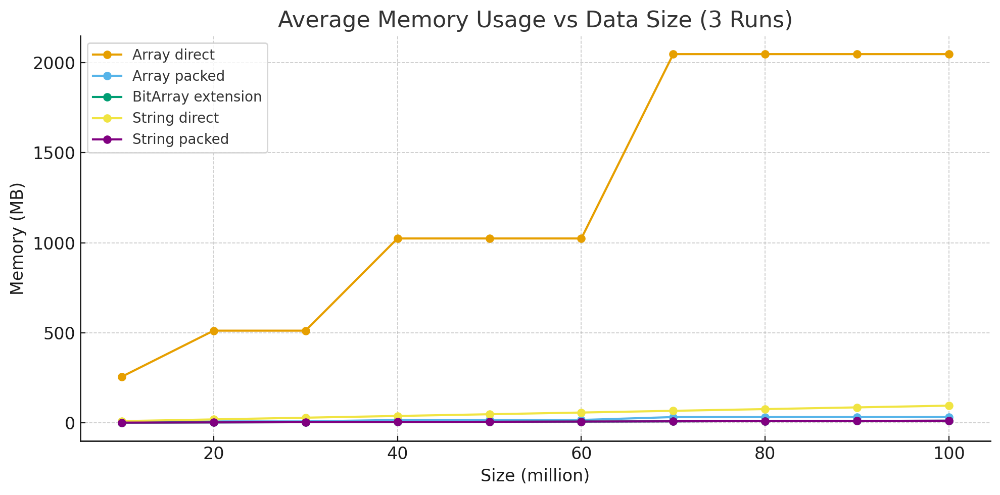
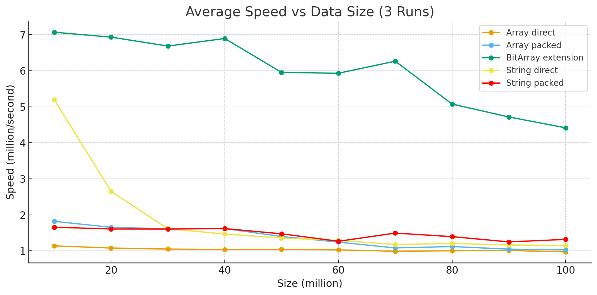

# PHP bitarray implementations

Experimental code to investigate various methods of providing a simple, direct access bit array in PHP, able to handle many (tens of millions of) boolean value elements. We compare several methods available in standard PHP and a custom PHP extension to provide faster, more memory efficient storage.

The following storage methods were compared:

* *Array direct*: Standard PHP array directly storing true/false values.
* *Array direct*: PHP SplFixedArray directly storing true/false values.
* *String direct*: PHP string storing true/false values as one element per character.

* *Array packed*: Standard PHP array storing 64 true/false values packed into individual bits of each element.
* *SplFixedArray packed*: PHP SplFixedArray storing 64 true/false values packed into individual bits of each element.
* *String packed*: PHP string storing 8 true/false values packed into each character.

* *BitArray extension*: Custom PHP extension providing packed bit storage directly into memory, 64 bits per location.

Notes:

* The BitArray extension was written directly in C, and compiled with gcc second level optimisations enabled (-O2). No time was spent on manual optimisation, so the code itself may not be optimal.
* Although we use only single bit true/false values here, the bit-packing approach could equally be applied to storing larger values. For example, values in the range of 0 to 7 could be stored in 3 bits.
* Measured speeds here are likely to be considerably affected by memory cache. This is probably the main reason why the bit-packed storage methods generally outperform the direct methods.
* Test environment: AMD Ryzen 7 5800H, 40 GB main RAM, Ubuntu 24.04.3 LTS, PHP 8.3.6 (cli).

# Graphical comparison

Graphs showing memory usage and speed variation for a range of 10 million to 100 million bit-array elements, testing read/write random access (see tests/bit_storage_test.php).

* The SplFixedArray storage is not included here, as results were very similar to those for standard array.
* On the memory graph, the *BitArray extension* (green) line is hidden by the *string packed* (purple) line because they almost exactly match.

### Conclusions

   1. Unsurprisingly, the only storage methods which do not have a significant memory overhead are the *string packed* and *BitArray extension*.
   2. Although the simplest to implement, the *standard array* and *SplFixedArray* methods both have a huge memory overhead, which makes them entirely unsuitable unless the required array size is small.
   3. The *string direct* storage method strikes a balance of reasonable memory efficiency with performance and simplicity. However, performance is good only for an array size under 10 million elements, and drops rapidly with increasing array size. This is presumably due to how PHP stores very long strings.
   4. The *string packed* storage provides memory efficiency with better performance than other methods available with standard PHP.
   5. The *BitArray extension* is clearly the overall winner for both memory efficiency and performance, assuming that use of a custom PHP extension is an acceptable design decision. It handles array size of 100 million elements with excellent speed and no memory overhead.

### Build, test and install

Steps to compile and install the custom bitarray PHP extension. You can skip this if you want to compare only the other (standard PHP) storage methods outlined above.

    make clean && phpize \
    && CFLAGS='-O2' ./configure --enable-bitarray \
    && make \
    && echo "Running sudo make install:" && sudo make install \
    && make test TESTS=tests/*.phpt

### Performance and memory comparison of storage types

Memory usage and speed for 10 million bit-array elements, testing read/write random access (see tests/bit_storage_test.php).

### All

Test/compare all available storage types, 10 million bits, single run. This will take a while to complete!

`php tests/bit_storage_test.php 0 10000000 1`

    Example output:

    Storage for 10,000,000 bits, method: 'ALL' storage.
    Array direct: 
      [1] Storage memory: 256.00 MB (21,375% overhead). Speed: 1.12 million/second.
    SplFixedArray direct: 
      [1] Storage memory: 152.59 MB (12,700% overhead). Speed: 1.09 million/second.
    String direct: 
      [1] Storage memory: 9.54 MB (700% overhead). Speed: 4.30 million/second.
    Array packed: 
      [1] Storage memory: 4.00 MB (236% overhead). Speed: 1.78 million/second.
    SplFixedArray packed: 
      [1] Storage memory: 2.39 MB (100% overhead). Speed: 1.64 million/second.
    String packed: 
      [1] Storage memory: 1.20 MB (0% overhead). Speed: 1.61 million/second.
    BitArray extension: 
      [1] Storage memory: 1.20 MB (0% overhead). Speed: 7.27 million/second.

### String direct
Test "string direct" storage, 10 million bits, three runs. 

`php tests/bit_storage_test.php 3 10000000 3`

    Example output:

    Storage for 10,000,000 bits, method: 'String direct' storage.
      [1] Storage memory: 9.54 MB (700% overhead). Speed: 4.32 million/second.
      [2] Storage memory: 9.54 MB (700% overhead). Speed: 3.93 million/second.
      [3] Storage memory: 9.54 MB (700% overhead). Speed: 2.92 million/second.

### String packed
Test "string packed" storage, 10 million bits, three runs. 

`php tests/bit_storage_test.php 6 10000000 3`

    Example output:

    Storage for 10,000,000 bits, method: 'String packed' storage.
      [1] Storage memory: 1.19 MB (0% overhead). Speed: 1.59 million/second.
      [2] Storage memory: 1.20 MB (0% overhead). Speed: 1.63 million/second.
      [3] Storage memory: 1.20 MB (0% overhead). Speed: 1.64 million/second.

### PHP extension
Test "BitArray extension" storage, 10 million bits, three runs. 

`php tests/bit_storage_test.php 7 10000000 3`

    Example output:

    Storage for 10,000,000 bits, method: 'BitArray extension' storage.
      [1] Storage memory: 1.20 MB (0% overhead). Speed: 6.74 million/second.
      [2] Storage memory: 1.20 MB (0% overhead). Speed: 6.61 million/second.
      [3] Storage memory: 1.20 MB (0% overhead). Speed: 6.43 million/second.
